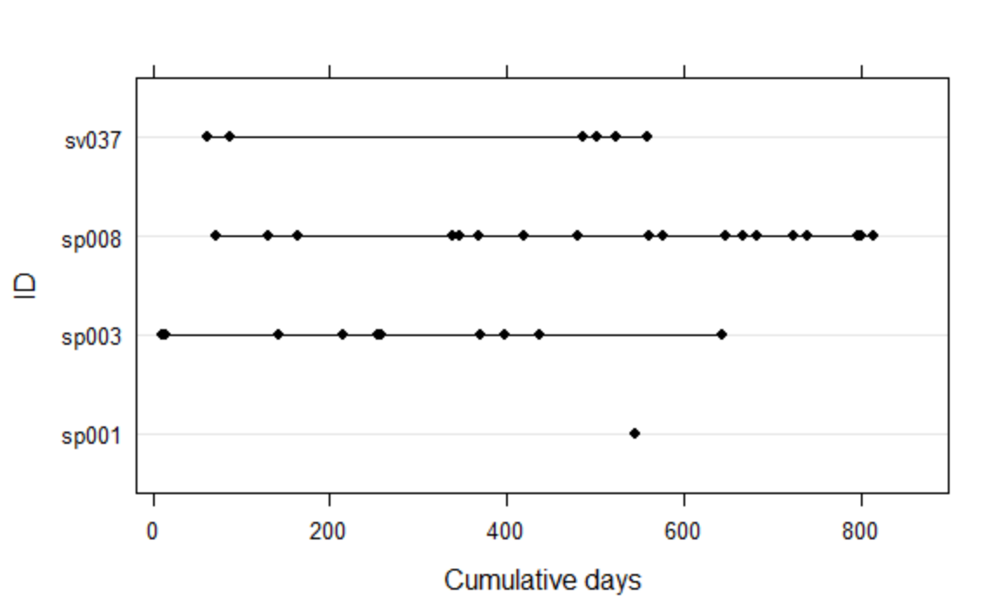
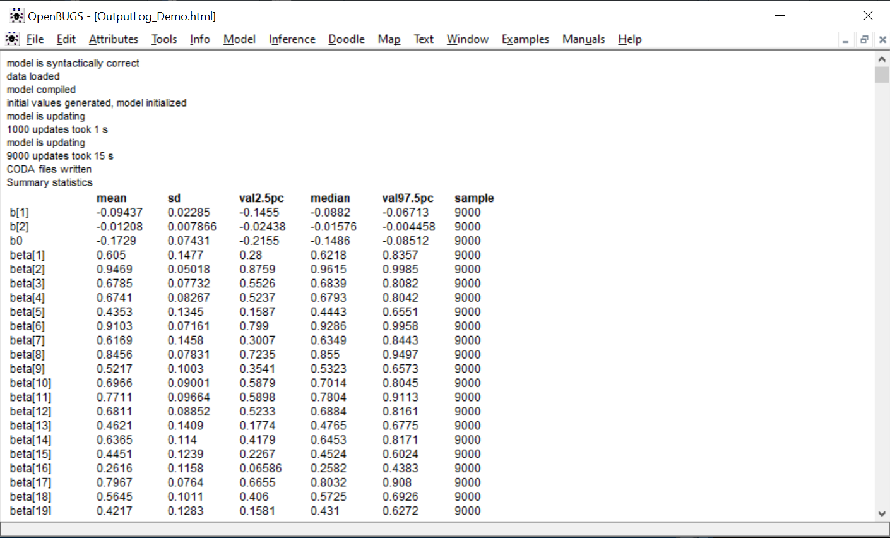

# FallRisk_RAMS2017
## About
### This is a demo to demonstrate the work of fall risk assessment, from one of the research projects listed in [Suiyao Chen's Homepage](https://sites.google.com/mail.usf.edu/suiyaochen-professional/publication?authuser=0). 
### The paper [Personalized Fall Risk Assessment for Long-term Care Services Improvement](https://www.researchgate.net/publication/315849472_Personalized_fall_risk_assessment_for_long-term_care_services_improvement) has been published in [2017 Annual Reliability and Maintainability Symposium (RAMS)](https://ieeexplore.ieee.org/document/7889692). 

## Instructions
- **Plot.R** is used to generation the visualizaiton plot for the time-to-event data **daystofall_Plot.csv** in the **Data** folder. 
The plot will show as below:

- **Demo.R** is used to build the model and run through Openbugs. The demo illustrates the model with covariates. The output of Openbugs will show as below:

